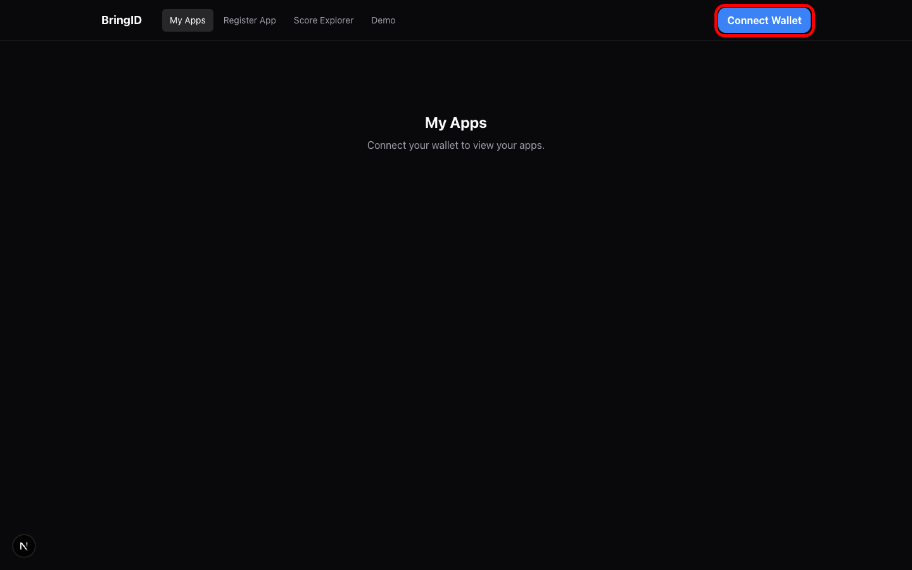
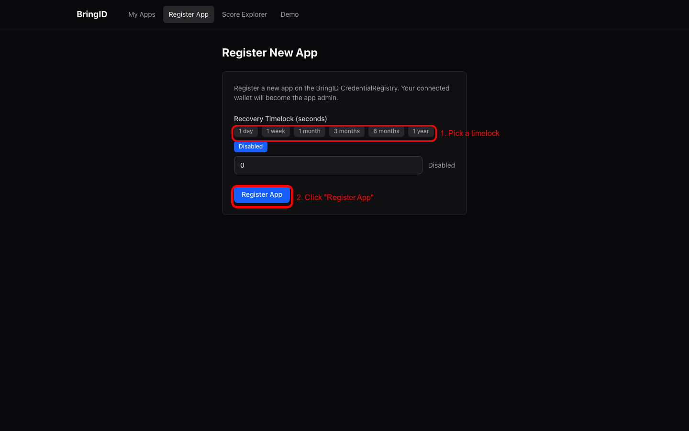
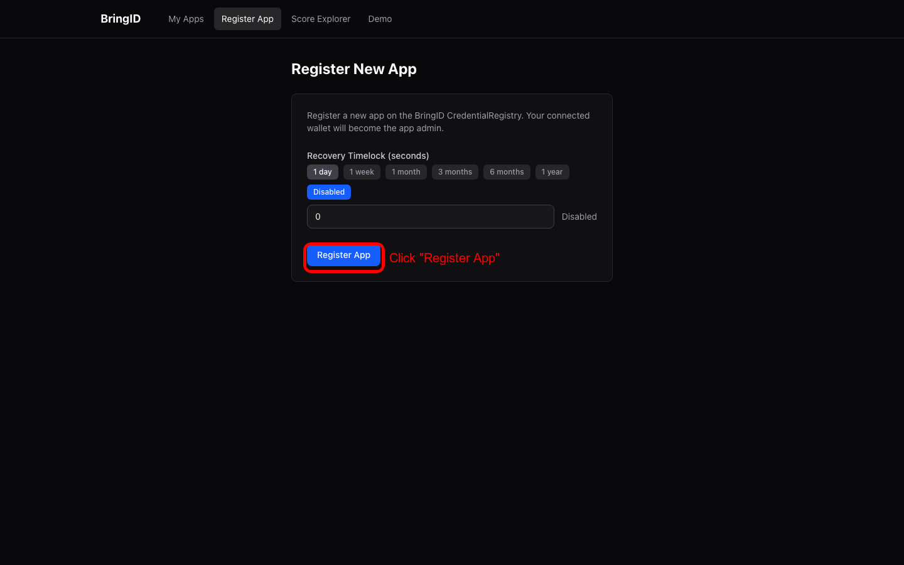
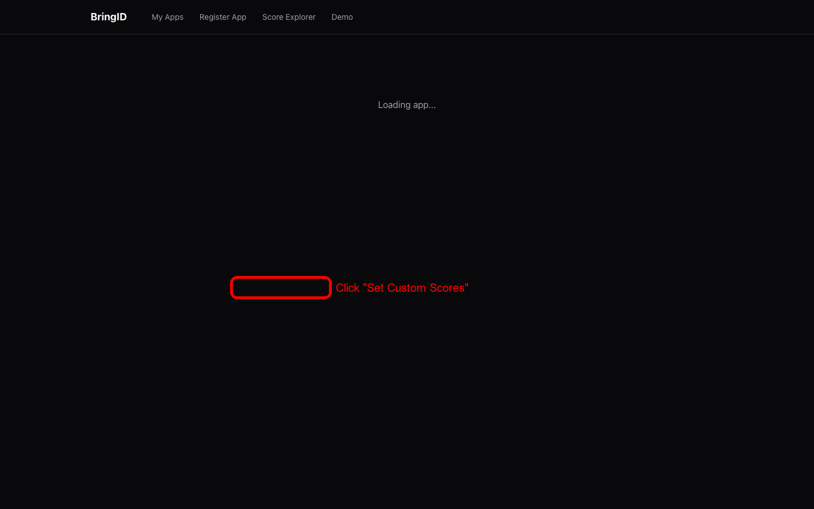
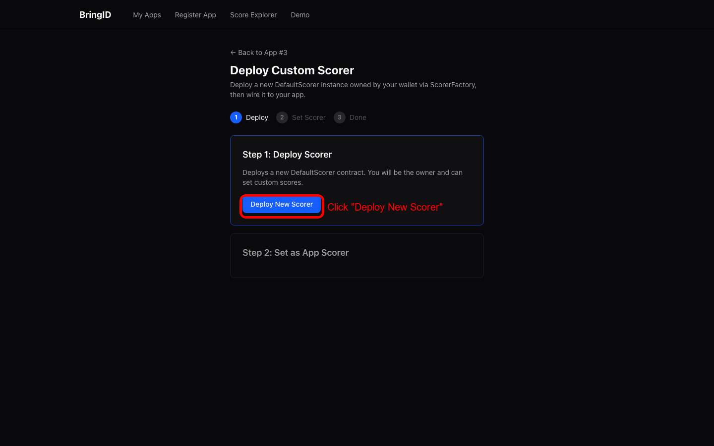
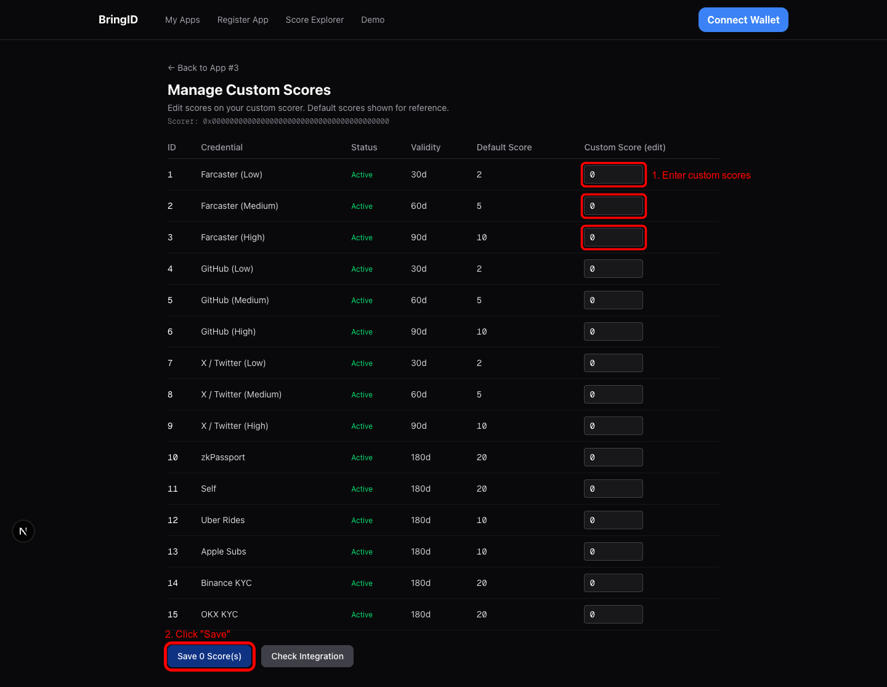
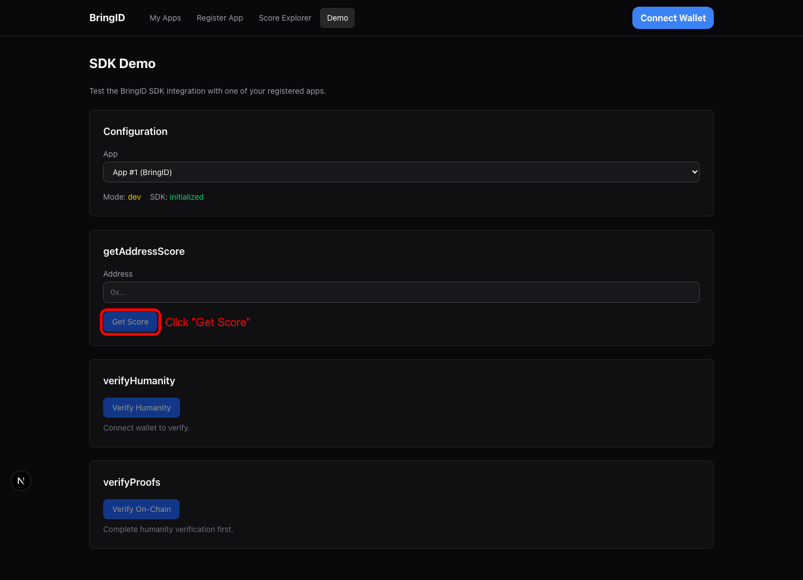
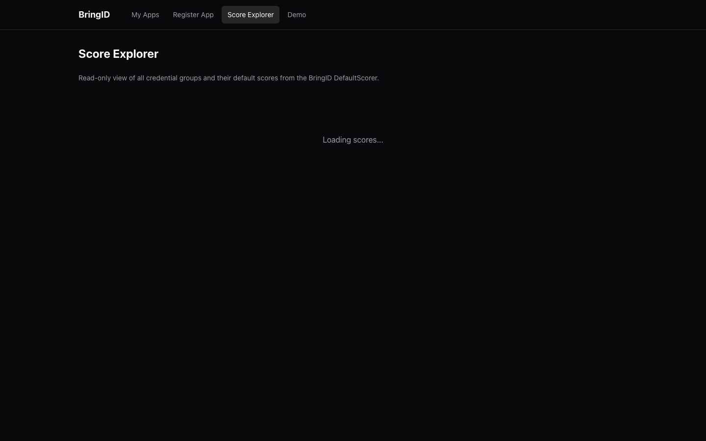

# Guide: Creating an App & Setting a Custom Scorer

This guide walks through registering a new app on the BringID CredentialRegistry and deploying a custom scorer with personalized credential group scores.

> **Video walkthrough:** See the full UI flow in action — [walkthrough.mp4](../e2e/videos/walkthrough.mp4)

## Prerequisites

- A wallet (MetaMask, Coinbase Wallet, etc.) connected to **Base** (mainnet) or **Base Sepolia** (testnet)
- Some ETH on the target chain for gas fees
- The App Manager running at [https://app-manager.bringid.com](https://app-manager.bringid.com) (or `http://localhost:3000` for local development)

---

## Step 1: Connect Your Wallet

Navigate to the App Manager. You'll land on the **My Apps** page, which prompts you to connect your wallet.

Click **Connect Wallet** in the top-right corner. Select your wallet provider from the modal (MetaMask, Coinbase Wallet, WalletConnect, etc.) and approve the connection.

> Make sure your wallet is on the correct network (Base for production, Base Sepolia for testing).

---

## Step 2: Register a New App

Click **Register App** in the navigation bar to open the registration form.

### Configure the Recovery Timelock

The **Recovery Timelock** determines how long admin recovery actions take. Choose a preset or enter a custom value in seconds:

| Preset    | Seconds    |
|-----------|------------|
| 1 day     | 86,400     |
| 1 week    | 604,800    |
| 1 month   | 2,592,000  |
| 3 months  | 7,776,000  |
| 6 months  | 15,552,000 |
| 1 year    | 31,536,000 |
| Disabled  | 0          |

Select a timelock value. For this example, we choose **1 day** (86,400 seconds):

### Submit the Transaction

Click **Register App**. Your wallet will prompt you to confirm the transaction. The button will show:

1. **"Confirm in wallet..."** — waiting for you to approve in your wallet
2. **"Confirming..."** — transaction submitted, waiting for on-chain confirmation
3. **"Confirmed!"** — transaction mined successfully

### Success

Once confirmed, a success banner appears showing your new **App ID**:

> **App Registered!**
> Your App ID is **3**
> Save this ID — you'll need it to manage your app.

You'll see two options:
- **Go to App Settings** — navigate to your app's management page
- **Register Another** — register an additional app

Click **Go to App Settings** to continue.

---

## Step 3: View App Settings

The App Settings page (`/apps/{appId}`) shows your app's full configuration:

- **Status** — Active or Suspended, with a toggle button
- **Recovery Timelock** — current value with an option to update
- **Admin Transfer** — transfer admin rights to another address (irreversible)
- **Scorer Configuration** — which scorer your app uses

By default, new apps use the **BringID Default Scorer**. To customize scoring, you need to deploy and set a custom scorer.

From the Scorer Configuration section, click **"Set Custom Scores"**.

---

## Step 4: Deploy a Custom Scorer

The Deploy Custom Scorer page (`/apps/{appId}/scorer/deploy`) guides you through a **3-step wizard**:

### Step 4a: Deploy Scorer Contract

Click **Deploy New Scorer**. This calls the `ScorerFactory.create()` contract, deploying a new `DefaultScorer` instance owned by your wallet.

Confirm the transaction in your wallet. Once mined, the wizard advances to Step 2 and displays your new scorer's contract address.

> **Tip:** If you previously deployed a scorer, it will appear in the "You already have N deployed scorer(s)" section with a **Reuse** button, letting you skip this step.

### Step 4b: Set Scorer on App

The wizard shows: *"Scorer deployed at `0x47e5...7bf5`"*

Click **Set App Scorer**. This calls `CredentialRegistry.setAppScorer(appId, scorerAddress)` to wire the new scorer to your app.

Confirm the transaction. Once mined, the wizard advances to Step 3.

### Step 4c: Done

A green success banner confirms:

> **Custom Scorer Set!**
> Your app is now using a custom scorer. Set initial scores to customize scoring.

Click **Manage Scores** to configure your custom scores.

---

## Step 5: Set Custom Scores

The Manage Scores page (`/apps/{appId}/scorer/manage`) displays all 15 credential groups in an editable table:

### Understanding the Score Table

| Column | Description |
|--------|-------------|
| **ID** | Credential group ID (1-15) |
| **Credential** | Human-readable name (e.g., Farcaster Low, GitHub High, zkPassport) |
| **Status** | Whether the credential group is Active |
| **Validity** | How long a credential proof remains valid (30d, 60d, 90d, 180d) |
| **Default Score** | The BringID default score for reference |
| **Custom Score (edit)** | Your custom score — editable input field |

### Available Credential Groups

| ID | Credential | Default Score | Validity |
|----|-----------|---------------|----------|
| 1  | Farcaster (Low) | 2 | 30d |
| 2  | Farcaster (Medium) | 5 | 60d |
| 3  | Farcaster (High) | 10 | 90d |
| 4  | GitHub (Low) | 2 | 30d |
| 5  | GitHub (Medium) | 5 | 60d |
| 6  | GitHub (High) | 10 | 90d |
| 7  | X / Twitter (Low) | 2 | 30d |
| 8  | X / Twitter (Medium) | 5 | 60d |
| 9  | X / Twitter (High) | 10 | 90d |
| 10 | zkPassport | 20 | 180d |
| 11 | Self | 20 | 180d |
| 12 | Uber Rides | 10 | 180d |
| 13 | Apple Subs | 10 | 180d |
| 14 | Binance KYC | 20 | 180d |
| 15 | OKX KYC | 20 | 180d |

### Edit and Save Scores

1. Enter your desired scores in the **Custom Score (edit)** column. For example:
   - Farcaster (Low): `100`
   - Farcaster (Medium): `200`
   - Farcaster (High): `150`

2. The **Save** button updates to show how many scores you've changed: **"Save 3 Score(s)"**

3. Click the Save button. This calls `DefaultScorer.setScores(ids[], scores[])` in a single batch transaction.

4. Confirm in your wallet. Once mined, you'll see **"Transaction confirmed."** and the table refreshes with your new scores.

> **Reset** — Click to discard all unsaved changes and revert the inputs.

---

## Step 6: Verify Your Integration

After saving scores, click **Check Integration** at the bottom of the Manage Scores page. This opens the **SDK Demo** page pre-configured with your app.

The Demo page lets you test:

- **verifyHumanity** — Start the BringID humanity verification flow (opens a modal)
- **verifyProofs** — Verify on-chain proofs and see the score breakdown by credential group

---

## Score Explorer (Reference)

The **Score Explorer** page (`/scores`) provides a read-only view of all credential groups and their default scores from the BringID DefaultScorer:

Use this as a reference when deciding how to set your custom scores.

---

## Summary

| Step | Action | Contract Call |
|------|--------|---------------|
| 1 | Connect wallet | — |
| 2 | Register app with timelock | `CredentialRegistry.registerApp(timelock)` |
| 3 | View app settings | `CredentialRegistry.apps(appId)` (read) |
| 4a | Deploy custom scorer | `ScorerFactory.create()` |
| 4b | Wire scorer to app | `CredentialRegistry.setAppScorer(appId, scorer)` |
| 5 | Set custom scores | `DefaultScorer.setScores(ids[], scores[])` |
| 6 | Test integration | BringID SDK |

### Contract Addresses (Base & Base Sepolia)

| Contract | Address |
|----------|---------|
| CredentialRegistry | `0x4CeA320D9b08A3a32cfD55360E0fc2137542478d` |
| Default Scorer | `0xcE4A14a929FfF47df30216f4C8fa8907825F494F` |
| Scorer Factory | `0x7cE2d6AdA1a9ba7B03b1F6d0C84EC01c3005cCa9` |
