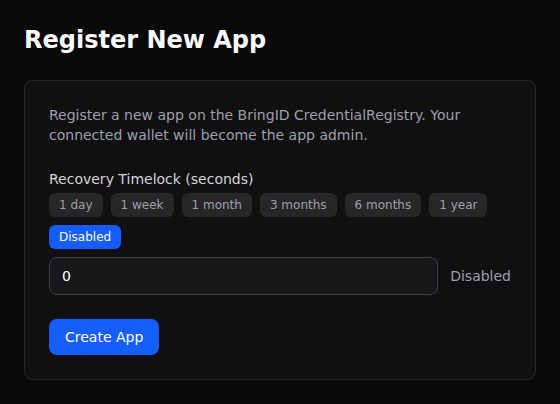
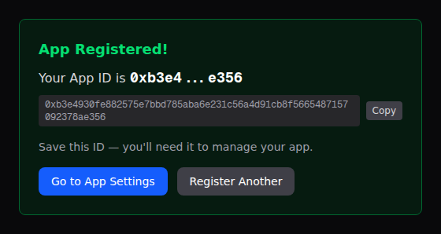

# Register a new app

Go to [manager.bringid.org/apps/new](https://manager.bringid.org/apps/new) to open the registration form.

1. Connect a crypto wallet. Your connected wallet becomes the app admin.
2. Set the recovery timelock (see below).
3. Click **Create App** and confirm the transaction in your wallet. Apps are registered onchain in the BringID CredentialRegistry contract.

## Recovery timelock

Recovery is a timelocked key replacement mechanism. If a user loses access to their wallet, they can re-authenticate through a verification flow to replace the key associated with their credential. The timelock sets a waiting period between initiating and finalizing recovery — during this window the user cannot generate proofs with either the old or new key, which prevents double-spend.

Choose a preset (1 day to 1 year), enter a custom value in seconds, or select Disabled to set it to 0. This setting can be changed later from the app settings page.

## Copy App ID

After the transaction confirms, a success banner displays your new App ID.

The App ID is a `0x`-prefixed hex value. Copy it — you pass this identifier to the BringID SDK to scope credentials and proofs to your app.

## What's next

All app settings — status, recovery timelock, scorer configuration, and admin transfer — can be modified later from the app settings page.

---

Next: [Set custom scores](guide-set-custom-scores.md)
