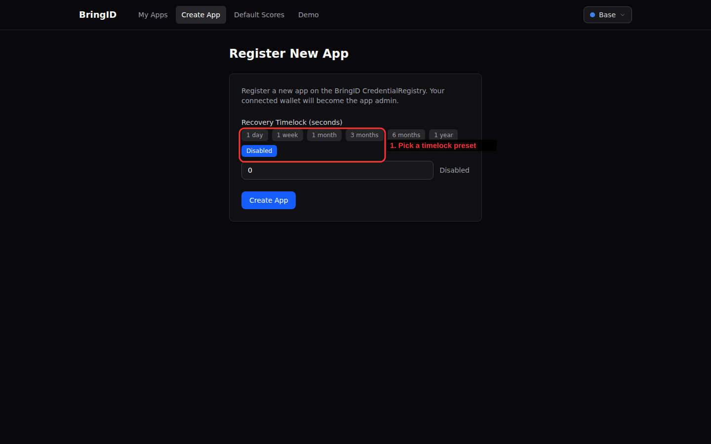
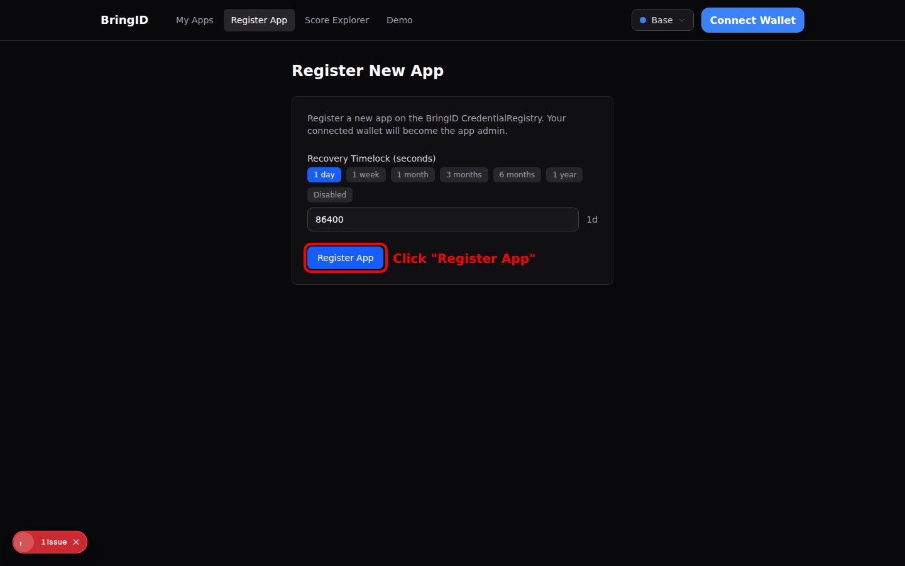
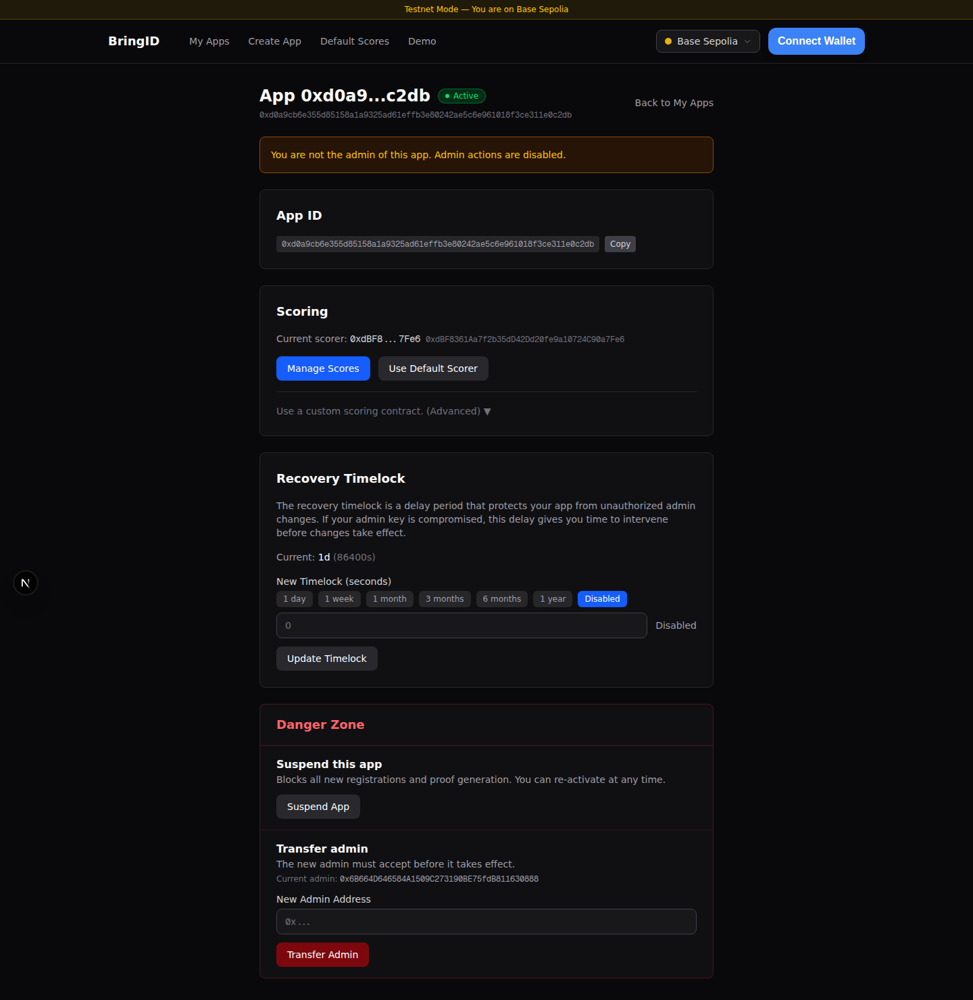

# Guide: Register an app

Register a new app on the BringID CredentialRegistry.

---

## Step 1: Register a new app

Click **Register App** in the navigation bar to open the registration form.

### Configure the recovery timelock

The **Recovery Timelock** determines how long admin recovery actions take. Choose a preset or enter a custom value in seconds:

| Preset    | Seconds    |
|-----------|------------|
| 1 day     | 86,400     |
| 1 week    | 604,800    |
| 1 month   | 2,592,000  |
| 3 months  | 7,776,000  |
| 6 months  | 15,552,000 |
| 1 year    | 31,536,000 |
| Disabled  | 0          |

Select a timelock value. For this example, we choose **1 day** (86,400 seconds):

### Submit the transaction

Click **Register App** and confirm the transaction in your wallet.

### Success

Once confirmed, a success banner appears showing your new **App ID**:

> **App Registered!**
> Your App ID is **3**
> Save this ID — you'll need it to manage your app.

You'll see two options:
- **Go to App Settings** — navigate to your app's management page
- **Register Another** — register an additional app

Click **Go to App Settings** to continue.

---

## Step 2: View app settings

The App Settings page (`/apps/{appId}`) shows your app's full configuration:

- **Status** — Active or Suspended, with a toggle button
- **Recovery Timelock** — current value with an option to update
- **Admin Transfer** — transfer admin rights to another address (irreversible)
- **Scorer Configuration** — which scorer your app uses

By default, new apps use the **BringID Default Scorer**. To customize scoring, you need to deploy and set a custom scorer.

From the Scorer Configuration section, click **"Set Custom Scores"**.

---

Next: [Set custom scores](guide-set-custom-scores.md)
