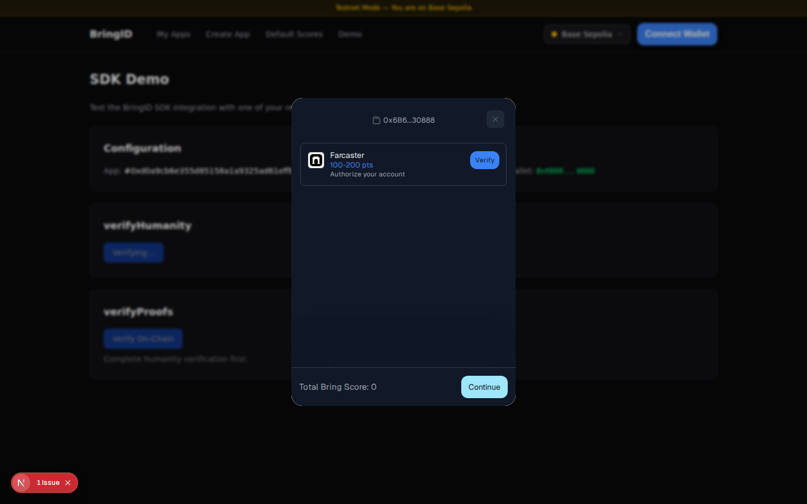

# Guide: Verify your integration

After saving scores, click **Check Integration** at the bottom of the Manage Scores page. This opens the **SDK Demo** page pre-configured with your app.

The Demo page lets you test:

- **verifyHumanity** — Start the BringID humanity verification flow (opens a modal)
- **verifyProofs** — Verify on-chain proofs and see the score breakdown by credential group
